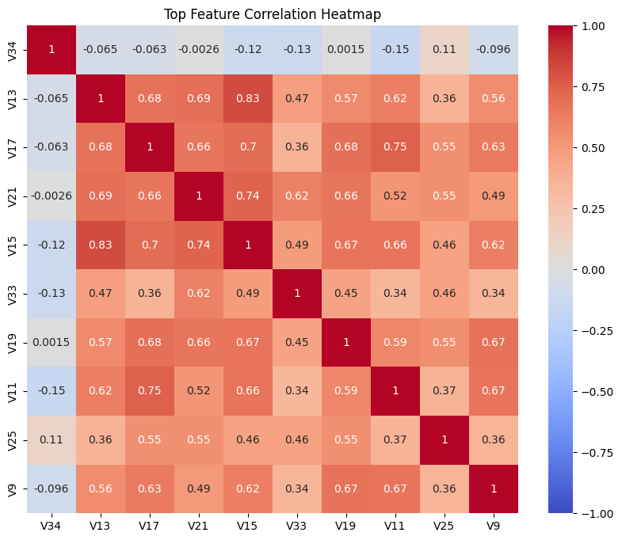
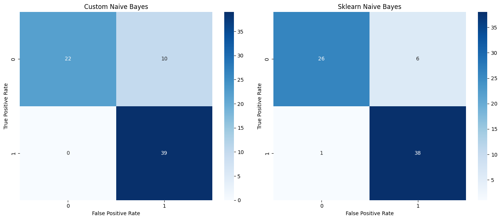
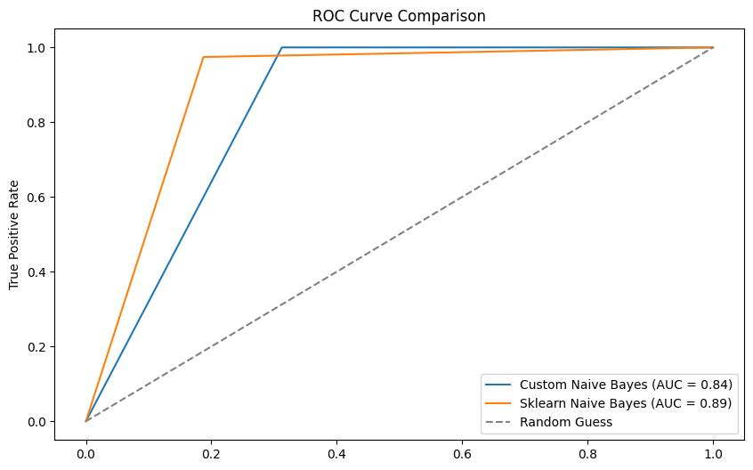
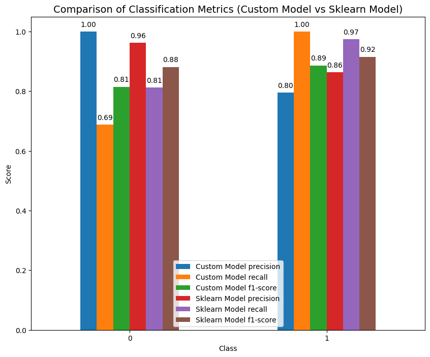
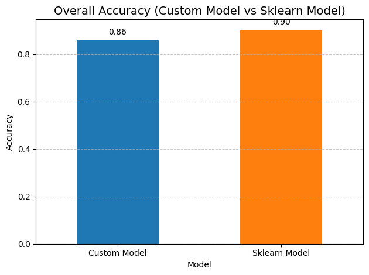

# Naive Bayes Binary Classification on Ionosphere Dataset

## Problem Statement

We are tasked with implementing a binary classification module using the Ionosphere dataset. The goal is to classify the data points as either `good` or `bad`, based on radar signals, and compare two implementations: one from scratch and the other using Sklearn.

## Dataset Overview

The **Ion Binary Classification Dataset** from the UCI Machine Learning Repository was used for this project. This dataset contains features derived from radar signals that classify whether a signal is **good** (Class 1) or **bad** (Class 0).

Both models were trained on **80% of the data** and tested on the remaining **20%** to evaluate their performance.

### Naive Bayes from Scratch

We implemented a Gaussian Naive Bayes classifier from scratch using the following steps:

- **Calculate Mean and Variance**: For each class `(good/bad)`, calculate the mean and variance for each feature.
- **Probability Calculation**: Compute the class-conditional probabilities using `Gaussian Probability Density`.
- **Posterior Calculation**: Use Bayes Theorem to compute posterior probabilities for each class and make a prediction based on the highest probability.
- **Evaluation**: Measure accuracy, precision, recall, and F1 score.

### Naive Bayes Using Sklearn

We also used the GaussianNB classifier from the Sklearn library for comparison:

- **Model Training**: Trained the model using the training data split.
- **Evaluation**: Predicted on test data and calculated performance metrics.

### Evaluation Metrics

The following metrics were used for performance evaluation:

- **Accuracy**: The percentage of correctly classified instances.
- **Precision**: The percentage of correct positive predictions.
- **Recall**: The percentage of actual positives correctly classified.
- **F1 Score**: The harmonic mean of precision and recall.
- **Confusion Matrix**: A matrix to visualize misclassifications.

### Feature Correlation Heatmap

## Results

### Confusion Matrix Comparison

### ROC Curve Comparison

### Overall Result

## Accuracy & Time Comparison

- **Time for Naive Bayes from Scratch**: `0.052051 seconds`
- **Time for Sklearn Naive Bayes**: `0.006583 seconds`

## Conclusion

The Sklearn implementation is faster and more accurate, benefiting from optimized underlying libraries. However, our custom implementation gives insight into how Naive Bayes works at the foundational level.
